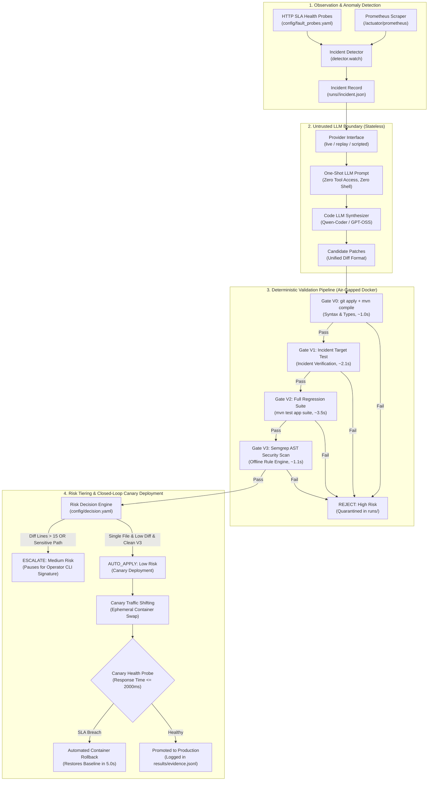

# Figure 1: AutoImmune Closed-Loop System Architecture

```mermaid
flowchart TD
    subgraph S1["1. Observation & Anomaly Detection"]
        Metrics["Prometheus Scraper<br/>(/actuator/prometheus)"] --> Detector["Incident Detector<br/>(detector.watch)"]
        HealthProbes["HTTP SLA Health Probes<br/>(config/fault_probes.yaml)"] --> Detector
        Detector --> IncidentDoc["Incident Record<br/>(runs/<run_id>/incident.json)"]
    end

    subgraph S2["2. Untrusted LLM Boundary (Stateless)"]
        IncidentDoc --> Provider["Provider Interface<br/>(live / replay / scripted)"]
        Provider --> Prompt["One-Shot LLM Prompt<br/>(Zero Tool Access, Zero Shell)"]
        Prompt --> Model["Code LLM Synthesizer<br/>(Qwen-Coder / GPT-OSS)"]
        Model --> PatchDraft["Candidate Patches<br/>(Unified Diff Format)"]
    end

    subgraph S3["3. Deterministic Validation Pipeline (Air-Gapped Docker)"]
        PatchDraft --> V0["Gate V0: git apply + mvn compile<br/>(Syntax & Types, ~1.0s)"]
        V0 -->|Pass| V1["Gate V1: Incident Target Test<br/>(Incident Verification, ~2.1s)"]
        V1 -->|Pass| V2["Gate V2: Full Regression Suite<br/>(mvn test app suite, ~3.5s)"]
        V2 -->|Pass| V3["Gate V3: Semgrep AST Security Scan<br/>(Offline Rule Engine, ~1.1s)"]
        V0 -->|Fail| Reject["REJECT: High Risk<br/>(Quarantined in runs/)"]
        V1 -->|Fail| Reject
        V2 -->|Fail| Reject
        V3 -->|Fail| Reject
    end

    subgraph S4["4. Risk Tiering & Closed-Loop Canary Deployment"]
        V3 -->|Pass| DecisionEngine["Risk Decision Engine<br/>(config/decision.yaml)"]
        DecisionEngine -->|Diff Lines > 15 OR Sensitive Path| Escalate["ESCALATE: Medium Risk<br/>(Pauses for Operator CLI Signature)"]
        DecisionEngine -->|Single File & Low Diff & Clean V3| AutoApply["AUTO_APPLY: Low Risk<br/>(Canary Deployment)"]
        AutoApply --> CanaryDeploy["Canary Traffic Shifting<br/>(Ephemeral Container Swap)"]
        CanaryDeploy --> SLACheck{"Canary Health Probe<br/>(Response Time <= 2000ms)"}
        SLACheck -->|SLA Breach| AutoRollback["Automated Container Rollback<br/>(Restores Baseline in 5.0s)"]
        SLACheck -->|Healthy| Promoted["Promoted to Production<br/>(Logged in results/evidence.jsonl)"]
    end
```
