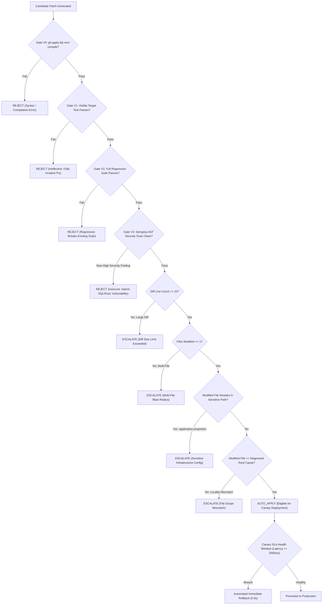

# Figure 2: AutoImmune Risk Tiering & Decision Logic

```mermaid
flowchart TD
    Start["Candidate Patch Generated"] --> V0Check{"Gate V0: git apply && mvn compile?"}
    V0Check -->|Fail| R0["REJECT (Syntax / Compilation Error)"]
    V0Check -->|Pass| V1Check{"Gate V1: Visible Target Test Passes?"}
    
    V1Check -->|Fail| R1["REJECT (Ineffective: Fails Incident Fix)"]
    V1Check -->|Pass| V2Check{"Gate V2: Full Regression Suite Passes?"}
    
    V2Check -->|Fail| R2["REJECT (Regressive: Breaks Existing Suite)"]
    V2Check -->|Pass| V3Check{"Gate V3: Semgrep AST Security Scan Clean?"}
    
    V3Check -->|New High Severity Finding| R3["REJECT (Insecure: Injects SQL/Exec Vulnerability)"]
    V3Check -->|Pass| Scope1{"Diff Line Count <= 15?"}
    
    Scope1 -->|No: Large Diff| E1["ESCALATE (Diff Size Limit Exceeded)"]
    Scope1 -->|Yes| Scope2{"Files Modified == 1?"}
    
    Scope2 -->|No: Multi-File| E2["ESCALATE (Multi-File Blast Radius)"]
    Scope2 -->|Yes| Scope3{"Modified File Resides in Sensitive Path?"}
    
    Scope3 -->|Yes: application.properties| E3["ESCALATE (Sensitive Infrastructure Config)"]
    Scope3 -->|No| Scope4{"Modified File == Diagnosed Root Cause?"}
    
    Scope4 -->|No: Locality Mismatch| E4["ESCALATE (File Scope Mismatch)"]
    Scope4 -->|Yes| Auto["AUTO_APPLY (Eligible for Canary Deployment)"]
    
    Auto --> Canary{"Canary SLA Health Window (Latency <= 2000ms)"}
    Canary -->|Breach| Rollback["Automated Immediate Rollback (5.0s)"]
    Canary -->|Healthy| Promoted["Promoted to Production"]
```
